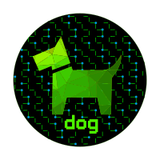

<p align="center">
  
</p>

<h1>Flan API</h1>

Flan API is an api that pulls data generated from Flan Scan [Flan Scan](https://bitbucket.org/republicwireless/flan_scan/src/master/) which is based off of CloudFlare's [Flan](https://github.com/cloudflare/flan) vulnerability scanner. This API will take a static file or a HTTP endpoint that contains a list of IPs/Hostnames and then gathers data from a flan scan located in s3, zips each ip/hostname together with the discovered apps and vulnerabilities and returns that data for consumption by Dog Park.

This API uses flask, UWSGI, and nginx. 

- [Runtime Dependencies](#runtime-dependencies)
- [Configuration](#configuration)
- [Systemd Configuration](#systemd-configuration)
- [Run](#run)

## Runtime Dependencies

- linux 4.x+ (Ubuntu 16.04+ tested)
- web server (nginx tested)
- python3, pip3

## Configuration

### config.json

A json file used to configure run time variables:

```{
    "url": "http://hostname:port/host_ips.txt",
    OR
    "file: "host_ips.txt",
    "s3_bucket" : "flan-scans"
}```

#### Key/Values

- url OR file: Specifices how host_ips.txt is accessed, either by local file OR URL request.
- host_ips.txt: 
    A text file with a list of IPs and hostnames, each line: "$IP $FullyQualifiedDomainName"
    There is one line per IP, so if a host has multiple IPs, there will be duplicate FQDNs.
    Hosts are filtered by the Environment variable "-$DOG_ENV-" (set in systemd service config).
    Example: DOG_ENV=qa, so flan_api only uses servers containing '-qa-' in their name.

    ```
    1.2.3.4 server-qa-01.domain.com
    2.3.4.5 server-qa-01.domain.com
    ```

- s3_bucket: This is the bucket that flan has been configured to output to.


APP_DESTINATION=/opt/flan_api
```bash
sudo mkdir ${APP_DESTINATION}/flan_api/
cd ${APP_DESTINATION}/flan_api/
git clone <flan_api repo>
sudo ./setup_flan_api.sh
```
## Systemd Configuration

```
[Unit]
Description=uWSGI instance to serve flan_api
After=network.target

[Service]
User=flan
Group=www-data
WorkingDirectory=/opt/flan_api
Environment="PATH=/opt/flan_api/flan_api_venv/bin/"
Environment="DOG_ENV=qa"
ExecStart=/opt/flan_api/flan_api_venv/bin/uwsgi --ini flan_scan_api.ini

[Install]
WantedBy=multi-user.target
```

## Sample Nginx Configuration

- Protect with an authentication proxy: [oauth2-proxy](https://oauth2-proxy.github.io/oauth2-proxy/)
- Configure your web server to proxy /api to dog_trainer at [http://localhost:7070/api/](http://localhost:7070/api/)
- Create a directory /opt/flan_api
- If you do not want to configure flan with dog, you can add the following to disable it:
```echo "[]" > /opt/flan/flan_api/flan_ips```
- If you do want it configured, the flan_api nginx config is listed below:

example nginx config:

```nginx
location /flan_api/ {
     auth_request /oauth2/auth;
     error_page 401 = /oauth2/sign_in;

     # pass information via X-User and X-Email headers to backend,
     # requires running with --set-xauthrequest flag
     auth_request_set $user   $upstream_http_x_auth_request_user;
     auth_request_set $email  $upstream_http_x_auth_request_email;
     proxy_set_header X-User  $user;
     proxy_set_header X-Email $email;

     # if you enabled --cookie-refresh, this is needed for it to work with auth_request
     auth_request_set $auth_cookie $upstream_http_set_cookie;
     add_header Set-Cookie $auth_cookie;
     uwsgi_pass unix:///opt/flan_api/flan_scan_api.sock;
     include uwsgi_params;
     #proxy_pass http://127.0.0.1:5000/;

     proxy_http_version 1.1;
     proxy_set_header Upgrade $http_upgrade;
     proxy_set_header Connection "upgrade";

     proxy_set_header  Host $host;
     proxy_set_header   X-Real-IP        $remote_addr;
     proxy_set_header   X-Real-Port      $remote_port;
     proxy_set_header   X-Forwarded-Proto $scheme;
}
```

## Run

sudo systemctl start flan_api.service

